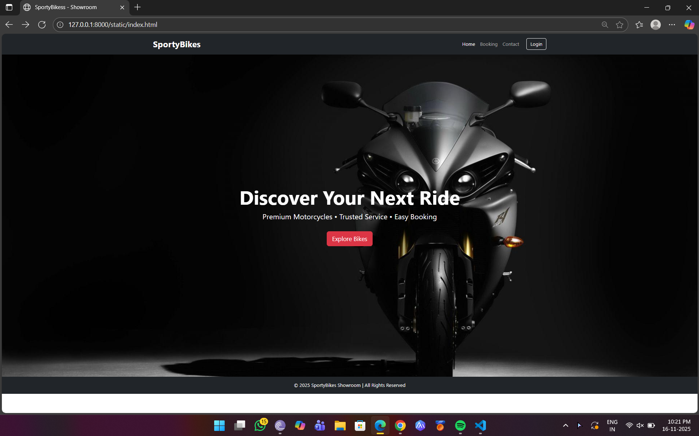
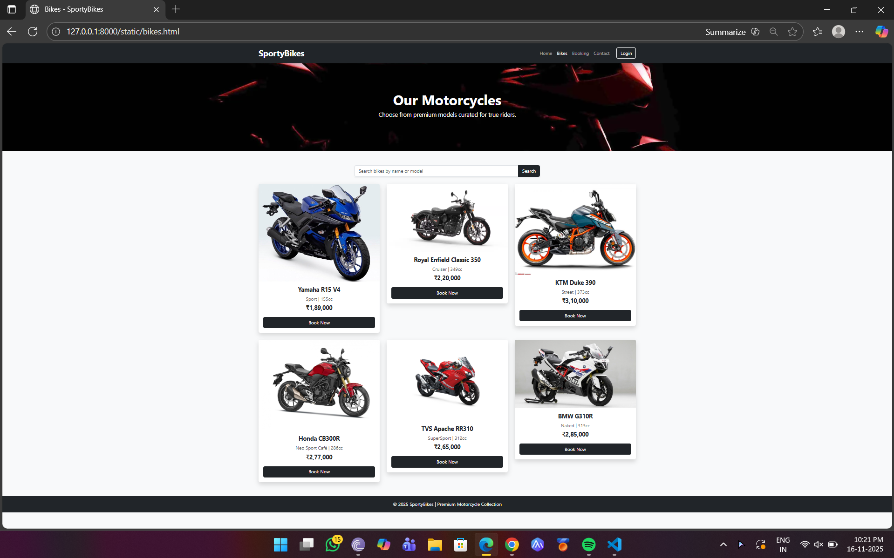
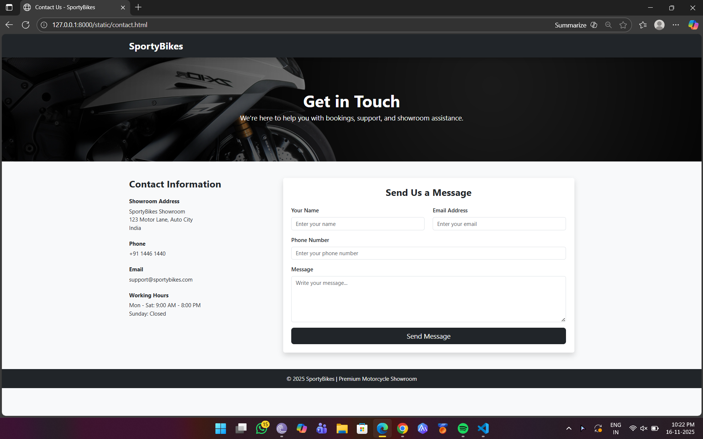
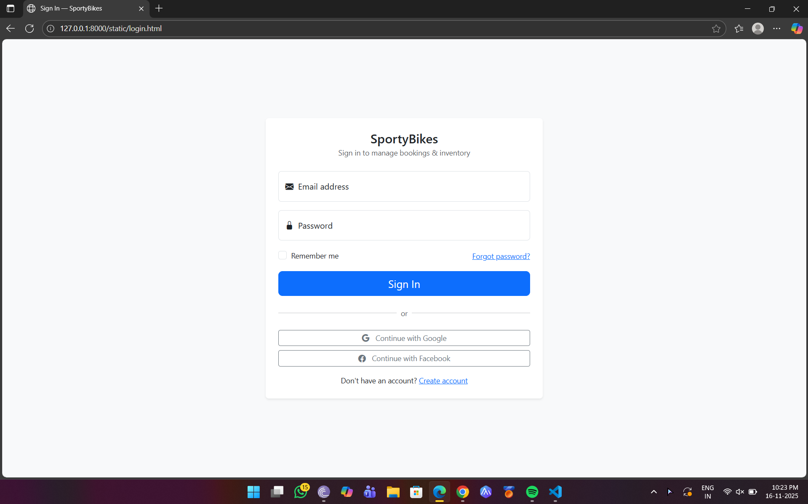

# Project Responsive Web Design using Bootstrap
## Date: 17/11/2025

## AIM:
To create a simplified clone of Dribbble (https://dribbble.com/) landing page.


## DESIGN STEPS:

### Step 1:
Clone the repository from GitHub.

### Step 2:
Create Django Admin project.

### Step 3:
Create a New App under the Django Admin project.

### Step 4:
Insert the necessary CSS and JavaScript files as external in order to use Bootstrap.

### Step 5:
Create a HTML file and include the needed Bootstrap components.

### Step 6:
Publish the website in the LocalHost.

## PROGRAM :
```
INDEX.HTML:

<!DOCTYPE html>
<html lang="en">
<head>
    <meta charset="UTF-8">
    <meta name="viewport" content="width=device-width, initial-scale=1.0">
    <title>SportyBikess - Showroom</title>

    <!-- Bootstrap CSS -->
    <link href="https://cdn.jsdelivr.net/npm/bootstrap@5.3.2/dist/css/bootstrap.min.css" rel="stylesheet">

</head>
<body>

<!-- NAVBAR -->
<nav class="navbar navbar-expand-lg navbar-dark bg-dark shadow">
  <div class="container">
    <a class="navbar-brand fw-bold fs-3" href="index.html">SportyBikes</a>
    <button class="navbar-toggler" type="button" data-bs-toggle="collapse" data-bs-target="#navMenu">
      <span class="navbar-toggler-icon"></span>
    </button>

    <div class="collapse navbar-collapse" id="navMenu">
      <ul class="navbar-nav ms-auto">
        <li class="nav-item"><a class="nav-link active" href="index.html">Home</a></li>
        <li class="nav-item"><a class="nav-link" href="booking.html">Booking</a></li>
        <li class="nav-item"><a class="nav-link" href="contact.html">Contact</a></li>
        <li class="nav-item"><a class="btn btn-outline-light ms-3" href="login.html">Login</a></li>
      </ul>
    </div>
  </div>
</nav>

<!-- HERO SECTION -->
<div class="container-fluid p-0">
  <div class="text-white text-center d-flex align-items-center justify-content-center" 
       style="height: 85vh; background: url('https://wallpaperaccess.com/full/1433024.jpg') center/cover;">
    <div>
      <h1 class="fw-bold display-3">Discover Your Next Ride</h1>
      <p class="fs-4">Premium Motorcycles • Trusted Service • Easy Booking</p>
      <a href="bikes.html" class="btn btn-danger btn-lg mt-3">Explore Bikes</a>
    </div>
  </div>
</div>


<!-- FOOTER -->
<footer class="bg-dark text-white text-center py-3">
  <p class="mb-0">© 2025 SportyBikes Showroom | All Rights Reserved</p>
</footer>

<!-- Bootstrap JS -->
<script src="https://cdn.jsdelivr.net/npm/bootstrap@5.3.2/dist/js/bootstrap.bundle.min.js"></script>

</body>
</html>
```
```
BIKES.HTML:

<!DOCTYPE html>
<html lang="en">
<head>
    <meta charset="UTF-8">
    <meta name="viewport" content="width=device-width, initial-scale=1.0">
    <title>Bikes - SportyBikes</title>

    <!-- Bootstrap CSS -->
    <link href="https://cdn.jsdelivr.net/npm/bootstrap@5.3.2/dist/css/bootstrap.min.css" rel="stylesheet">

</head>
<body class="bg-light">

<!-- NAVBAR -->
<nav class="navbar navbar-expand-lg navbar-dark bg-dark shadow">
  <div class="container">
    <a class="navbar-brand fw-bold fs-3" href="index.html">SportyBikes</a>
    <button class="navbar-toggler" type="button" data-bs-toggle="collapse" data-bs-target="#navMenu">
      <span class="navbar-toggler-icon"></span>
    </button>

    <div class="collapse navbar-collapse" id="navMenu">
      <ul class="navbar-nav ms-auto">
        <li class="nav-item"><a class="nav-link" href="index.html">Home</a></li>
        <li class="nav-item"><a class="nav-link active" href="bikes.html">Bikes</a></li>
        <li class="nav-item"><a class="nav-link" href="booking.html">Booking</a></li>
        <li class="nav-item"><a class="nav-link" href="contact.html">Contact</a></li>
        <li class="nav-item"><a class="btn btn-outline-light ms-3" href="login.html">Login</a></li>
      </ul>
    </div>
  </div>
</nav>

<!-- PAGE HEADER -->
<section class="py-5 text-center text-white"
style="background: url('https://www.webbikeworld.com/wp-content/uploads/2021/08/Screen-Shot-2021-08-17-at-11.52.47-AM-scaled-1.jpg') center/cover;">
    <div class="container py-5">
        <h1 class="fw-bold display-5">Our Motorcycles</h1>
        <p class="fs-5">Choose from premium models curated for true riders.</p>
    </div>
</section>

<!-- BIKE LISTINGS -->
<section class="py-5">
    <div class="container">

        <!-- Search -->
        <div class="row mb-4">
            <div class="col-md-6 mx-auto">
                <div class="input-group shadow-sm">
                  <input type="text" class="form-control" placeholder="Search bikes by name or model">
                  <button class="btn btn-dark">Search</button>
                </div>
            </div>
        </div>

        <!-- Bikes Grid -->
        <div class="row g-4">

            <!-- Bike 1 -->
            <div class="col-md-4">
                <div class="card shadow border-0">
                    
                    <div class="card-body text-center">
                        <h5 class="fw-bold">Yamaha R15 V4</h5>
                        <p class="text-muted mb-1">Sport | 155cc</p>
                        <p class="fw-bold fs-5">₹1,89,000</p>
                        <a href="booking.html" class="btn btn-dark w-100">Book Now</a>
                    </div>
                </div>
            </div>

            <!-- Bike 2 -->
            <div class="col-md-4">
                <div class="card shadow border-0">
                    
                    <div class="card-body text-center">
                        <h5 class="fw-bold">Royal Enfield Classic 350</h5>
                        <p class="text-muted mb-1">Cruiser | 349cc</p>
                        <p class="fw-bold fs-5">₹2,20,000</p>
                        <a href="booking.html" class="btn btn-dark w-100">Book Now</a>
                    </div>
                </div>
            </div>

            <!-- Bike 3 -->
            <div class="col-md-4">
                <div class="card shadow border-0">
                    
                    <div class="card-body text-center">
                        <h5 class="fw-bold">KTM Duke 390</h5>
                        <p class="text-muted mb-1">Street | 373cc</p>
                        <p class="fw-bold fs-5">₹3,10,000</p>
                        <a href="booking.html" class="btn btn-dark w-100">Book Now</a>
                    </div>
                </div>
            </div>

            <!-- Bike 4 -->
            <div class="col-md-4">
                <div class="card shadow border-0">
                    
                    <div class="card-body text-center">
                        <h5 class="fw-bold">Honda CB300R</h5>
                        <p class="text-muted mb-1">Neo Sport Café | 286cc</p>
                        <p class="fw-bold fs-5">₹2,77,000</p>
                        <a href="booking.html" class="btn btn-dark w-100">Book Now</a>
                    </div>
                </div>
            </div>

            <!-- Bike 5 -->
            <div class="col-md-4">
                <div class="card shadow border-0">
                    
                    <div class="card-body text-center">
                        <h5 class="fw-bold">TVS Apache RR310</h5>
                        <p class="text-muted mb-1">SuperSport | 312cc</p>
                        <p class="fw-bold fs-5">₹2,65,000</p>
                        <a href="booking.html" class="btn btn-dark w-100">Book Now</a>
                    </div>
                </div>
            </div>

            <!-- Bike 6 -->
            <div class="col-md-4">
                <div class="card shadow border-0">
                    
                    <div class="card-body text-center">
                        <h5 class="fw-bold">BMW G310R</h5>
                        <p class="text-muted mb-1">Naked | 313cc</p>
                        <p class="fw-bold fs-5">₹2,85,000</p>
                        <a href="booking.html" class="btn btn-dark w-100">Book Now</a>
                    </div>
                </div>
            </div>

            

        </div>

    </div>
</section>

<!-- FOOTER -->
<footer class="bg-dark text-white text-center py-3">
    <p class="mb-0">© 2025 SportyBikes | Premium Motorcycle Collection</p>
</footer>

<!-- Bootstrap JS -->
<script src="https://cdn.jsdelivr.net/npm/bootstrap@5.3.2/dist/js/bootstrap.bundle.min.js"></script>

</body>
</html>
```
```
LOGIN.HTML:

<!doctype html>
<html lang="en">
<head>
  <meta charset="utf-8" />
  <meta name="viewport" content="width=device-width, initial-scale=1" />
  <title>Sign In — SportyBikes</title>

  <!-- Bootstrap CSS -->
  <link href="https://cdn.jsdelivr.net/npm/bootstrap@5.3.3/dist/css/bootstrap.min.css" rel="stylesheet">

  <!-- Optional: Bootstrap Icons -->
  <link href="https://cdn.jsdelivr.net/npm/bootstrap-icons@1.11.4/font/bootstrap-icons.css" rel="stylesheet">
</head>
<body class="bg-light">

  <main class="d-flex align-items-center min-vh-100 py-5">
    <div class="container">
      <div class="row justify-content-center">
        <div class="col-12 col-md-9 col-lg-6 col-xl-5">
          <!-- Card -->
          <div class="card shadow-sm border-0">
            <div class="row g-0">
              <div class="col-12 p-4">
                <!-- Header -->
                <div class="text-center mb-4">
                  <h4 class="mb-0">SportyBikes</h4>
                  <small class="text-muted">Sign in to manage bookings & inventory</small>
                </div>

                <!-- Form -->
                <form class="needs-validation" novalidate action="#" method="post">
                  <!-- Email -->
                  <div class="form-floating mb-3">
                    <input type="email" class="form-control" id="email" name="email" placeholder="name@example.com" required>
                    <label for="email"><i class="bi bi-envelope-fill me-1"></i> Email address</label>
                    <div class="invalid-feedback">Please provide a valid email.</div>
                  </div>

                  <!-- Password -->
                  <div class="form-floating mb-3">
                    <input type="password" class="form-control" id="password" name="password" placeholder="Password" minlength="6" required>
                    <label for="password"><i class="bi bi-lock-fill me-1"></i> Password</label>
                    <div class="invalid-feedback">Password must be at least 6 characters.</div>
                  </div>

                  <!-- Remember + Forgot -->
                  <div class="d-flex justify-content-between align-items-center mb-3">
                    <div class="form-check">
                      <input class="form-check-input" type="checkbox" value="" id="remember" name="remember">
                      <label class="form-check-label small" for="remember">Remember me</label>
                    </div>
                    <div>
                      <a href="#" data-bs-toggle="modal" data-bs-target="#forgotModal" class="small">Forgot password?</a>
                    </div>
                  </div>

                  <!-- Submit -->
                  <div class="d-grid mb-3">
                    <button type="submit" class="btn btn-primary btn-lg">Sign In</button>
                  </div>

                  <!-- Divider -->
                  <div class="d-flex align-items-center mb-3">
                    <hr class="flex-grow-1" />
                    <small class="text-muted mx-2">or</small>
                    <hr class="flex-grow-1" />
                  </div>

                  <!-- Social / SSO -->
                  <div class="d-grid gap-2 mb-3">
                    <button type="button" class="btn btn-outline-secondary btn-sm">
                      <i class="bi bi-google me-2"></i> Continue with Google
                    </button>
                    <button type="button" class="btn btn-outline-secondary btn-sm">
                      <i class="bi bi-facebook me-2"></i> Continue with Facebook
                    </button>
                  </div>

                  <!-- Sign up -->
                  <p class="text-center small mb-0">Don't have an account? <a href="register.html">Create account</a></p>
                </form>
              </div>

              <!-- Optional right-side image for larger screens -->
              <div class="d-none d-md-block col-md-5" style="background-image: url('https://images.unsplash.com/photo-1519974719765-e6559eac2575?auto=format&fit=crop&w=800&q=60'); background-size: cover; background-position: center;"></div>
            </div>
          </div>
          <!-- /Card -->
        </div>
      </div>
    </div>
  </main>

  <!-- Forgot Password Modal -->
  <div class="modal fade" id="forgotModal" tabindex="-1" aria-labelledby="forgotModalLabel" aria-hidden="true">
    <div class="modal-dialog modal-dialog-centered">
      <div class="modal-content">
        <form class="needs-validation" novalidate>
          <div class="modal-header">
            <h5 class="modal-title" id="forgotModalLabel">Reset password</h5>
            <button type="button" class="btn-close" data-bs-dismiss="modal" aria-label="Close"></button>
          </div>
          <div class="modal-body">
            <p class="small text-muted">Enter the email associated with your account. We'll send instructions to reset your password.</p>
            <div class="form-floating">
              <input type="email" class="form-control" id="resetEmail" name="resetEmail" placeholder="name@example.com" required>
              <label for="resetEmail">Email address</label>
              <div class="invalid-feedback">Please provide a valid email.</div>
            </div>
          </div>
          <div class="modal-footer">
            <button type="button" class="btn btn-outline-secondary" data-bs-dismiss="modal">Cancel</button>
            <button type="submit" class="btn btn-primary">Send reset link</button>
          </div>
        </form>
      </div>
    </div>
  </div>

  <!-- Bootstrap JS (Popper included) -->
  <script src="https://cdn.jsdelivr.net/npm/bootstrap@5.3.3/dist/js/bootstrap.bundle.min.js"></script>

  <!-- Client-side validation helper (Bootstrap examples pattern) -->
  <script>
    (function () {
      'use strict'
      // Fetch all forms we want to apply custom Bootstrap validation styles to
      var forms = document.querySelectorAll('.needs-validation')
      Array.prototype.slice.call(forms).forEach(function (form) {
        form.addEventListener('submit', function (event) {
          if (!form.checkValidity()) {
            event.preventDefault()
            event.stopPropagation()
          }
          form.classList.add('was-validated')
        }, false)
      })
    })()
  </script>
</body>
</html>
```
```
BOOKING.HTML:

<!DOCTYPE html>
<html lang="en">
<head>
    <meta charset="UTF-8">
    <meta name="viewport" content="width=device-width, initial-scale=1.0">
    <title>Bike Booking - SportyBikes</title>

    <!-- Bootstrap CSS -->
    <link href="https://cdn.jsdelivr.net/npm/bootstrap@5.3.2/dist/css/bootstrap.min.css" rel="stylesheet">

</head>

<body class="bg-light">

<!-- NAVBAR -->
<nav class="navbar navbar-expand-lg navbar-dark bg-dark shadow">
  <div class="container">
    <a class="navbar-brand fw-bold fs-3" href="index.html">SportyBikes</a>
  </div>
</nav>

<!-- HEADER SECTION -->
<section class="py-5 text-center text-white" 
style="background: url('https://th.bing.com/th/id/R.0d3226687abb11b6a1de360b1efb0675?rik=pbb2aKGlzjcukg&riu=http%3a%2f%2ftyretitans.in%2fcdn%2fshop%2fcollections%2fSuzuki_Hayabusa_Tyre.jpg%3fv%3d1708506623&ehk=XVS04C3mQeGrGGObv65nf9mU4UnTxMPNU4%2fQldZkeok%3d&risl=&pid=ImgRaw&r=0') center/cover;">
    <div class="container py-5">
        <h1 class="fw-bold display-5">Book Your Motorcycle</h1>
        <p class="fs-5 mb-0">Secure your ride today with a simple, fast booking process.</p>
    </div>
</section>

<!-- BOOKING FORM -->
<section class="py-5">
    <div class="container">

        <div class="row g-4 justify-content-center">

            <div class="col-lg-8">

                <div class="card shadow-lg border-0">
                    <div class="card-body p-4">

                        <h3 class="fw-bold text-center mb-4">Booking Information</h3>

                        <form>

                            <!-- Customer Details -->
                            <h5 class="fw-bold mb-3">Your Details</h5>

                            <div class="row">
                                <div class="col-md-6 mb-3">
                                    <label class="form-label fw-semibold">Full Name</label>
                                    <input type="text" class="form-control" placeholder="Enter your full name" required>
                                </div>

                                <div class="col-md-6 mb-3">
                                    <label class="form-label fw-semibold">Email Address</label>
                                    <input type="email" class="form-control" placeholder="Enter your email" required>
                                </div>
                            </div>

                            <div class="row">
                                <div class="col-md-6 mb-3">
                                    <label class="form-label fw-semibold">Phone Number</label>
                                    <input type="tel" class="form-control" placeholder="Enter phone number" required>
                                </div>

                                <div class="col-md-6 mb-3">
                                    <label class="form-label fw-semibold">City</label>
                                    <input type="text" class="form-control" placeholder="City" required>
                                </div>
                            </div>

                            <hr class="my-4">

                            <!-- Bike Selection -->
                            <h5 class="fw-bold mb-3">Bike Selection</h5>

                            <div class="mb-3">
                                <label class="form-label fw-semibold">Select Bike Model</label>
                                <select class="form-select" required>
                                    <option value="" disabled selected>Select a model</option>
                                    <option>Yamaha R15 V4 - ₹1,89,000</option>
                                    <option>Royal Enfield Classic 350 - ₹2,20,000</option>
                                    <option>KTM Duke 390 - ₹3,10,000</option>
                                    <option>Honda CB300R - ₹2,77,000</option>
                                    <option>TVS Apache RR310 - ₹2,65,000</option>
                                    <option>BMW G310R - ₹2,85,000</option>
                                </select>
                            </div>

                            <div class="row">
                                <div class="col-md-6 mb-3">
                                    <label class="form-label fw-semibold">Color Preference</label>
                                    <select class="form-select" required>
                                        <option selected disabled>Select color</option>
                                        <option>Red</option>
                                        <option>Black</option>
                                        <option>White</option>
                                        <option>Blue</option>
                                        <option>Grey</option>
                                    </select>
                                </div>

                                <div class="col-md-6 mb-3">
                                    <label class="form-label fw-semibold">Booking Date</label>
                                    <input type="date" class="form-control" required>
                                </div>
                            </div>

                            <hr class="my-4">

                            <!-- Payment Details -->
                            <h5 class="fw-bold mb-3">Payment</h5>

                            <div class="mb-3">
                                <label class="form-label fw-semibold">Payment Method</label>
                                <select class="form-select" required>
                                    <option selected disabled>Select payment mode</option>
                                    <option>Full Payment</option>
                                    <option>Down Payment (Booking Advance)</option>
                                    <option>EMI / Finance</option>
                                </select>
                            </div>

                            <hr class="my-4">

                            <!-- Submit -->
                            <div class="d-grid">
                                <button class="btn btn-dark btn-lg">Confirm Booking</button>
                            </div>

                        </form>

                    </div>
                </div>

            </div>

        </div>

    </div>
</section>


<!-- Bootstrap JS -->
<script src="https://cdn.jsdelivr.net/npm/bootstrap@5.3.2/dist/js/bootstrap.bundle.min.js"></script>

</body>
</html>
```
```
CONTACT.HTML:

<!DOCTYPE html>
<html lang="en">
<head>
    <meta charset="UTF-8">
    <meta name="viewport" content="width=device-width, initial-scale=1.0">
    <title>Contact Us - SportyBikes</title>

    <!-- Bootstrap CSS -->
    <link href="https://cdn.jsdelivr.net/npm/bootstrap@5.3.2/dist/css/bootstrap.min.css" rel="stylesheet">
</head>

<body class="bg-light">

<!-- NAVBAR -->
<nav class="navbar navbar-expand-lg navbar-dark bg-dark shadow">
  <div class="container">
    <a class="navbar-brand fw-bold fs-3" href="index.html">SportyBikes</a>
  </div>
</nav>

<!-- CONTACT HEADER -->
<section class="py-5 text-center text-white" 
style="background: url('https://woodpeck.org/wp-content/uploads/revslider/main-home-inner-1/h1-rev-inner1-img-4.jpg') center/cover;">
    <div class="container py-5">
        <h1 class="fw-bold display-5">Get in Touch</h1>
        <p class="fs-5">We're here to help you with bookings, support, and showroom assistance.</p>
    </div>
</section>

<!-- CONTACT DETAILS + FORM -->
<section class="py-5">
    <div class="container">

        <div class="row g-5">

            <!-- CONTACT INFO -->
            <div class="col-md-4">
                <h3 class="fw-bold mb-4">Contact Information</h3>

                <div class="mb-4">
                    <h6 class="fw-bold">Showroom Address</h6>
                    <p class="mb-0">SportyBikes Showroom</p>
                    <p class="mb-0">123 Motor Lane, Auto City</p>
                    <p>India</p>
                </div>

                <div class="mb-4">
                    <h6 class="fw-bold">Phone</h6>
                    <p class="mb-0">+91 1446 1440</p>
                </div>

                <div class="mb-4">
                    <h6 class="fw-bold">Email</h6>
                    <p class="mb-0">support@sportybikes.com</p>
                </div>

                <div class="mb-4">
                    <h6 class="fw-bold">Working Hours</h6>
                    <p class="mb-0">Mon - Sat: 9:00 AM - 8:00 PM</p>
                    <p>Sunday: Closed</p>
                </div>
            </div>

            <!-- CONTACT FORM -->
            <div class="col-md-8">
                <div class="card shadow border-0">
                    <div class="card-body p-4">
                        <h3 class="fw-bold mb-4 text-center">Send Us a Message</h3>

                        <form>

                            <div class="row">
                                <!-- Name -->
                                <div class="col-md-6 mb-3">
                                    <label class="form-label fw-semibold">Your Name</label>
                                    <input type="text" class="form-control" placeholder="Enter your name" required>
                                </div>

                                <!-- Email -->
                                <div class="col-md-6 mb-3">
                                    <label class="form-label fw-semibold">Email Address</label>
                                    <input type="email" class="form-control" placeholder="Enter your email" required>
                                </div>
                            </div>

                            <!-- Phone -->
                            <div class="mb-3">
                                <label class="form-label fw-semibold">Phone Number</label>
                                <input type="tel" class="form-control" placeholder="Enter your phone number" required>
                            </div>

                            <!-- Message -->
                            <div class="mb-3">
                                <label class="form-label fw-semibold">Message</label>
                                <textarea class="form-control" rows="5" placeholder="Write your message..." required></textarea>
                            </div>

                            <!-- Submit -->
                            <div class="d-grid">
                                <button class="btn btn-dark btn-lg">Send Message</button>
                            </div>

                        </form>

                    </div>
                </div>
            </div>

        </div>

    </div>
</section>

<!-- FOOTER -->
<footer class="bg-dark text-white text-center py-3">
    <p class="mb-0">© 2025 SportyBikes | Premium Motorcycle Showroom</p>
</footer>

<!-- Bootstrap JS -->
<script src="https://cdn.jsdelivr.net/npm/bootstrap@5.3.2/dist/js/bootstrap.bundle.min.js"></script>

</body>
</html>
```


## OUTPUT:






## RESULT:
The Project for responsive web design using Bootstrap is completed successfully.
